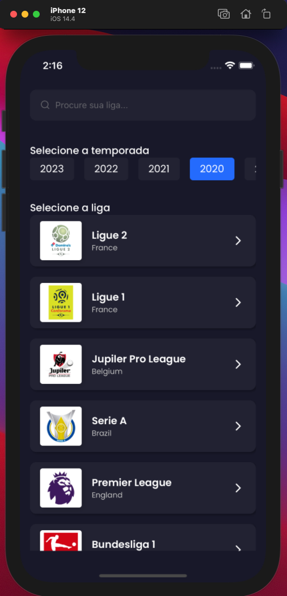
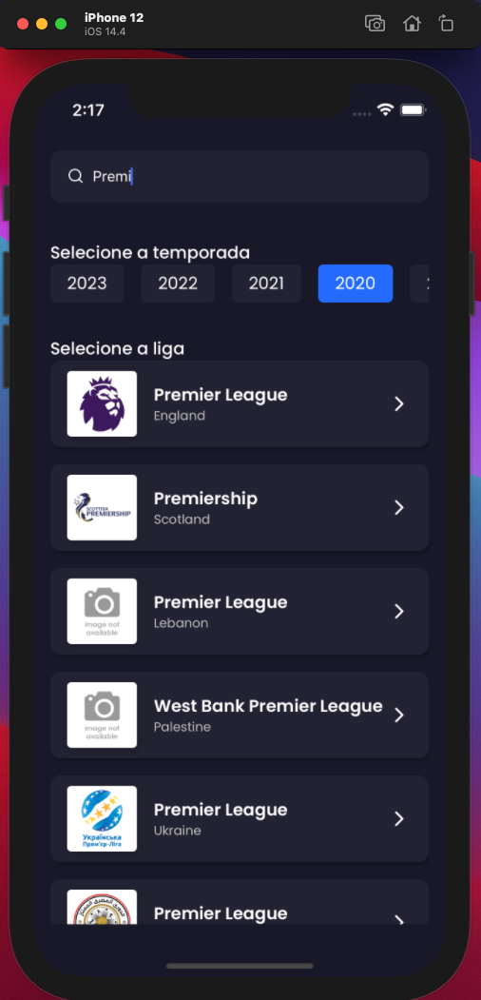
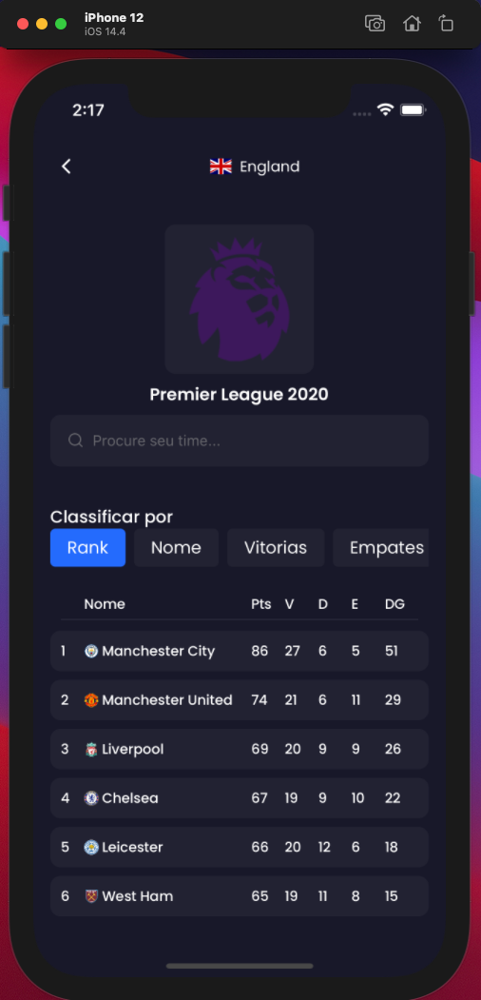
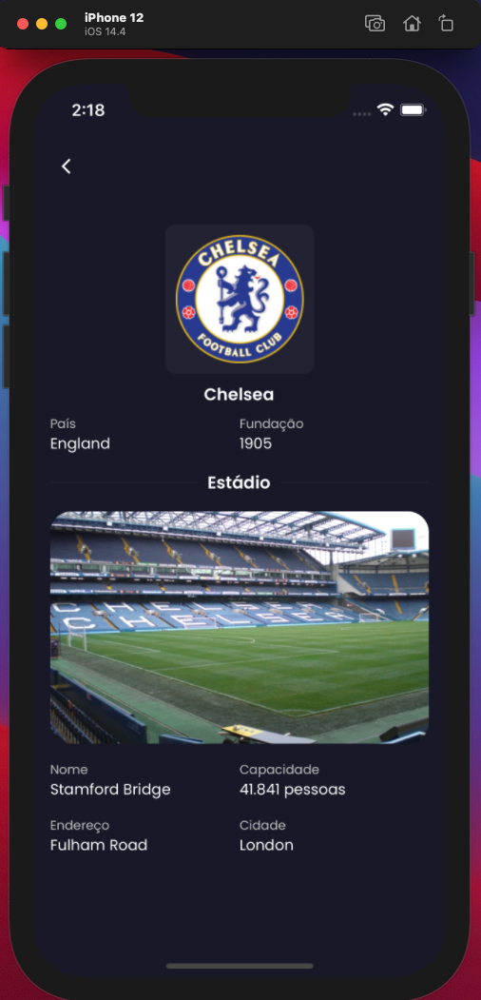

<h1 align="center">Challenge App X</h1>
<div align="center">


</div>


## Install

You need the [Node.js](https://nodejs.org/en/download/) and [Yarn](https://classic.yarnpkg.com/en/docs/install/) to run this project, if ios will need [Cocoapods](https://guides.cocoapods.org/using/getting-started.html), this project was created with `Node.js v14.17.0`, `Yarn v1.22.10` and `Cocoapods v1.10.1`.

### IOS

```bash
yarn install
cd ios
pod install
cd ..
cp .env.template .env
yarn ios
yarn start
```

### Android

```bash
yarn install
yarn android
cp .env.template .env
yarn start
```

## Screenshots

### Home
<div align="center">
  
  
  <br /> <br />
</div>

### Classification
<div align="center">
   
   
     <br /> <br />
</div>

### Classification Filter
<div align="center">
   
     <br /> <br />
</div>

## License

The [MIT License]() (MIT)

Copyright© 2021
